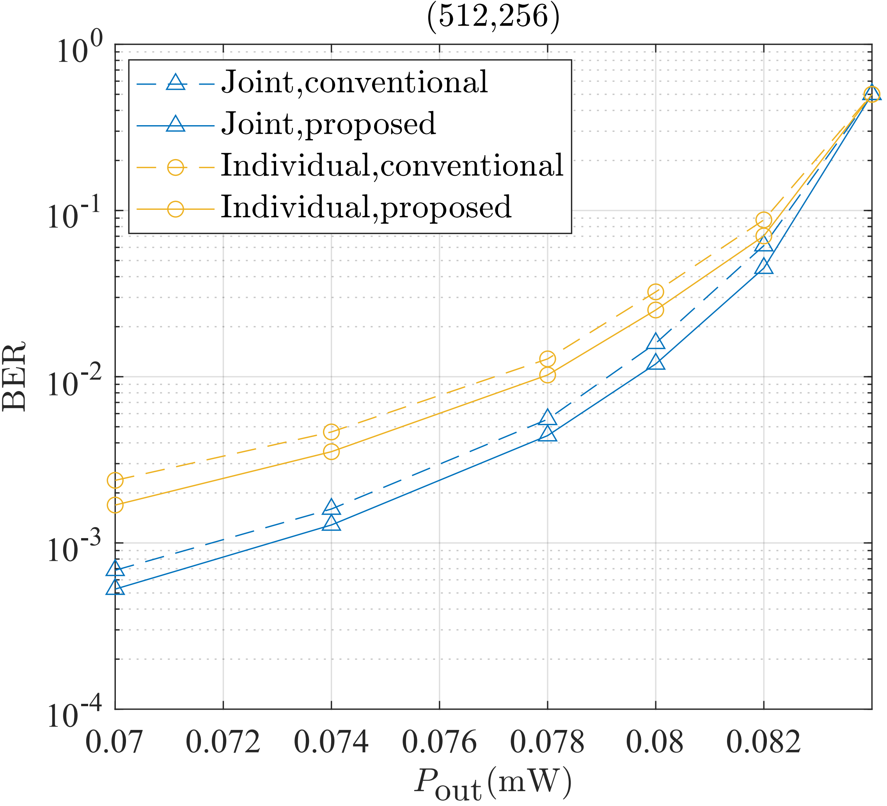
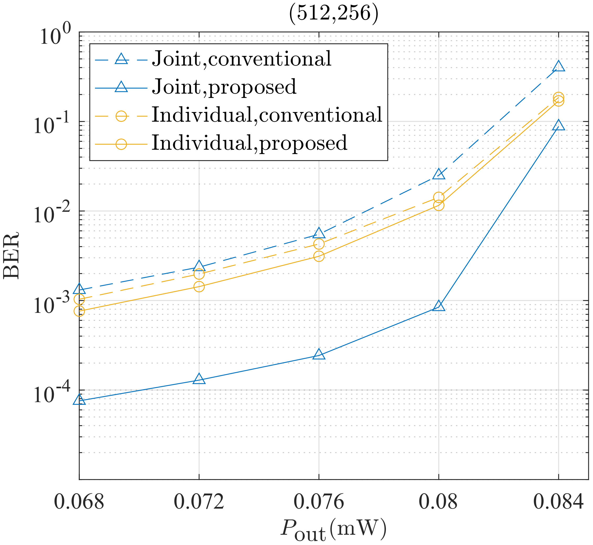

# About the paper

### Abstract

In unmanned aerial vehicle (UAV)-based scenarios, sensing-aided integrated data and energy networking (IDEN) systems can significantly mitigate non-line-of-sight (NLoS) propagation, thereby enhancing sensing accuracy. However, the rapid channel variations induced by UAV mobility pose a challenge for traditional polar code construction methods, making it difficult to satisfy the stringent requirements of IDEN systems. To address this challenge, we propose a neural network (NN)-based sensing-aided IDEN framework. This system leverages sensing information to assist polar code construction while satisfying energy constraints. Furthermore, it incorporates neural networks to optimize the performance of polar codes in dynamic environments. Specifically, a sensing-aided binarized neural network (BNN)-based polar encoder is proposed for both low-latency and high-reliability requirements, and a deep neural network (DNN)-based polar decoder is applied to match the encoder. Moreover, the corresponding training method is proposed, which focuses on the initialization design of the NNs. The simulation results show that the NN-based sensing-aided polar encoding scheme outperforms the conventional counterparts in terms of IDEN for both low-latency and high-reliability requirements.

### System Model

We consider a scenario under a sensing-assisted integrated data and energy network (IDEN) system, where a mobile unmanned aerial vehicle (UAV) charges and communicates with fixed ground devices. A complete sensing and simultaneous wireless information and power transfer (SWIPT) process is divided into $T$ time slots, where the first time slot is dedicated to sensing, and the subsequent $T-1$ time slots are used for SWIPT.

### System Architecture

The system consists of three components: a sensing module, a transmitter, and a receiver. The sensing module acquires the target's location information and channel state information (CSI); the transmitter utilizes the sensing information to guide the construction of polar codes; and the receiver splits the received signal into two branches via a power splitter for simultaneous energy harvesting (EH) and decoding.

### Simulation Results

         

Simulations compare the conventional algorithm and the proposed algorithm under near-target and far-target scenarios, employing both joint coding and independent coding schemes. The results demonstrate that the proposed algorithm consistently outperforms the conventional algorithm.

### Files

**CompsingleEnergy**: Traditional control group of individual coding.
	-ParamOfSingle: Corresponding CSI.

**WithEnSingleBNN**: Individual coding scheme based on BNN.
	-ParamOfSingleBNN: Corresponding CSI.

**WithEnergy**: Joint coding scheme.
	-main_with_energy: Joint coding scheme based on NN.
	-comp_energy: Traditional control group of joint coding.

**sensing**: Sensing related procedures and parameters.

**Sys_params.pickle**: Model parameters of EH.

### Others

**Paper Link**: https://ieeexplore.ieee.org/document/11357507

**Copyright Notice**: This paper is original content. Reproduction is prohibited without prior permission and please include the original source link and this statement.